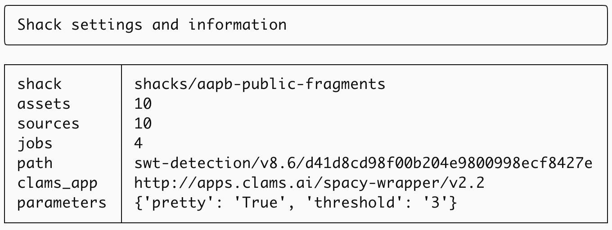
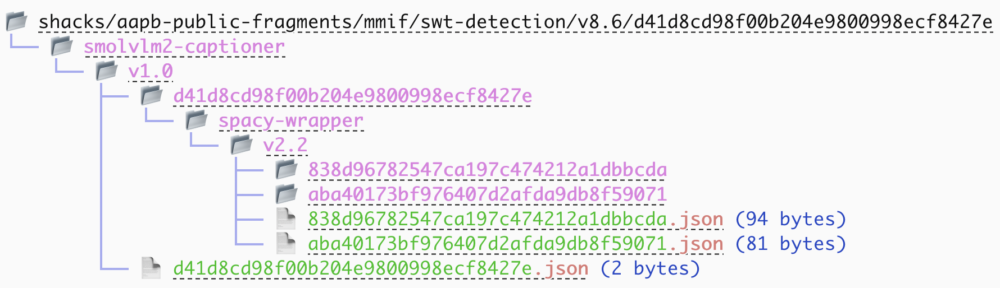

# ClamShack manual

How to use the ClamShack and its ClamShell command line interface.


## 1. Introduction

The ClamShack and the ClamShell together form a tool for running CLAMS applications over relatively small sets of data. It makes it much easier for a developer to actually manage processing some data, but is definitely not a tool to be used by a lay person. Rather, it is for people with some general knowledge of what CLAMS is as well as the ability to (1) run code in terminals and (2) start a CLAMS application as a Docker or Podman container.

Assumptions:

- Relatively small Shack sizes, no more than a thousand assets.
- Once a Shack is initialized with a set of assets you cannot add or remove assets later.
- There is some way to get the type (video or text) from the assets path.
- When running a job, existing files in the storage will never be overwritten. However, you should be able to explicitly remove all results from a job (which would also remove any downstream results).
- Assets have unique identifiers. The only exception is when there is the same identifier for a video asset and a text asset, which are then assumed to be different modalities of the same asset.
- MMIF files always end with `.mmif`.
- All asset and MMIF file management happens through the Shack.
- All assets are available on a local or mounted disk.
- CLAMS Apps (at least one) are running and are available on a port, typically via containers.
- A Linux-like system to run this all on.

The names used to be CLAMS Shack and CLAMS Shell, but that felt clunky with the two esses. They were changed into ClamShack and ClamShell, which somewhat looses its connection to what the acronym stands for but does on the other hand feel so much better. ClamShack will often be abbreviated to Shack and ClamShell to Shell.


### Running the Shack and the Shell

This requires Python 3.12 or later and the modules named in the requirements file. Install the dependencies as follows (you may want to do this in a virtual environment):

```bash
pip install -r requirements.txt
```

To create a shack:

```bash
python -m api.cli --shack <DIRECTORY> --assets <FILE>
```

This creates a new directory, if the directory already exists then the code will exit with a warning.

To open an already existing Shack:

```bash
python -m api.cli --shack <DIRECTORY>
```

After either command you end up in the ClamShell terminal where you have access to a bunch of commands as well as to the `shack` variable, which contains the Python ClamShack object. Type "help" or "?" to get a list of available commands and type "help COMMAND" or "? COMMAND" to get command-specific help.

The prompt in the terminal is a shell symbol followed by the name of the Shack:

```bash
🐚 (shack-name)
```

> Unfortunately the shell symbol is not quite a clam shell, that symbol did not appear to be available as a unicode character.


## 2. Assets

Every ClamShack is associated with an assets list, this association can be made only once when you create a new shack. Once you have specified a set of assets you cannot change them anymore, you would have to create a new Shack if you want to do that.

> This may be changed at some point and we may allow extra assets to be added later. For now we like how this makes sure you always now that each job that was run for this Shack has always applied to the same assets. It constrains what you can do and hence cuts down on a lot of potentially confusing extra functionality.

The assets list looks like this:

```
/Users/Shared/aapb/assets/
video/cpb-aacip-ektu19x2tppz.mp4
text/cpb-aacip-ektu19x2tppz.txt
video/cpb-aacip-c0s1okl2t02r.mp4
text/cpb-aacip-c0s1okl2t02r.txt
```

There is a top-level directory (which will be the one mounted to `/data` on the container, see below) followed by relative paths from the top-level directory. The full path should point to an existing file. Note how the path gives away what asset type we are dealing with, for now we only deal with video and text assets, where the text is typically a transcript for a video.

For now we make sure that the asset names match the GUID requirements of the AAPB data, that is, they start with `cpb-aacip-` and followed by a set of digits and lowercase letters. There can be multiple assets for each GUID.

When adding assets we automatically create a source MMIF file for each asset or pair of assets for a certain GUID. The assets themselves are not stored in the Shack, instead a list of absolute asset paths to the original location is maintained.

> Creating MMIF sources does not use the code in the `mmif source` utility. That code seems oddly complex and should be revised.

MMIF source files live in the ClamShack directory in `sources` and look like this:

```python
{
  "metadata": {
    "mmif": "http://mmif.clams.ai/1.1.0"
  },
  "documents": [
    {
      "@type": "http://mmif.clams.ai/vocabulary/VideoDocument/v1",
      "properties": {
        "mime": "video/mp4",
        "id": "d1",
        "location": "file:///data/video/cpb-aacip-ektu19x2tppz.mp4"
      }
    },
    {
      "@type": "http://mmif.clams.ai/vocabulary/TextDocument/v1",
      "properties": {
        "id": "d2",
        "location": "file:///data/text/cpb-aacip-ektu19x2tppz.txt"
      }
    }
  ],
  "views": []
}
```

Note how the location has appended the relative path of the asset from the list to a the top-level directory named `file:///data`, which points to the container's data directory.


## 3. Workflows and CLAMS Apps

The Shack has only access to CLAMS Apps that are running on ports, typically as Docker or Podman containers. Those apps can be registered by providing the host name and the port for the app.

Running an app requires several things from the user:

- Make sure CLAMS Apps are running in containers.
- Register an app with the ClamShack.
- Select one of the available apps to form a one-app workflow (multi-app workflow are a later worry).
- Set run-time parameters that will be handed to the app.
- Select the input by navigating through the MMIF storage.
- Create a unique name for the job and then start the job, which will run in the background as a separate process. This latter step will probably only work on Linux-like systems.

We will go through these steps one-by-one.

Next up is to make sure that apps are registered from available Docker container that are exposed on a port. This could be done by searching the list of active containers and pinging them to see any app metadata are volunteered.


### Step 1: CLAMS Containers

As mentioned above, running containers are needed for the Shack. Here is as an example how to run the spaCy container. First get the image:

```bash
docker pull ghcr.io/clamsproject/app-spacy-wrapper:v2.2
```

As usual the tricky part is to mount the container correctly so it can find the assets. We mount the `/data` directory on the container to the local directory where the assets live, using the asset list example from above:

```bash
docker run --rm -d -p 5001:5000 -v /Users/Shared/aapb/assets:/data --name spacy ghcr.io/clamsproject/app-spacy-wrapper:v2.2
```

Basically, the `/data` directory maps to the highest path that governs all assets. 

Now we can access the metadata of the app or run it from a terminal:

```
curl http://127.0.0.1:5001
cat test/sources/cpb-aacip-p38dffl7ov46.mmif | curl -X POST 127.0.0.1:5001 -d@-
```

This example above assumes that there is a `test` directory with a ClamShack in it.
 
 
### Step 2: Registration

From the Shack you can now register the app:

```
🐚 (test) register http://127.0.0.1:5001
Registered http://apps.clams.ai/spacy-wrapper/v2.1
```

Registration involves the ClamShack retrieving the applications identifier from the metadata of the app and storing the identifier and the URL in a dictionary. You can get this dictionary by typing `apps` or `shack.apps` in the ClamShell, in the latter case you get the following (and in the former case you can a pretty print, which you will see in the next section):

```python
{'http://apps.clams.ai/spacy-wrapper/v2.1': 'http://127.0.0.1:5001'}
```

Instead of using a full URL like `http://127.0.0.1:5001` you can also use `127.0.0.1:5001`.


### Step 3: CLAMS App selection

This is simple now that we only do a one-app pipeline, simply select the one registered application:

```
🐚 (test) apps
╭─────────────────────────────────────────────────────────────────────────────────╮
│ Registered CLAMS Apps                                                           │
╰─────────────────────────────────────────────────────────────────────────────────╯
 0: http://apps.clams.ai/spacy-wrapper/v2.1

🐚 (test) apps 0
Selected http://apps.clams.ai/spacy-wrapper/v2.1
```

The first commands list the registered apps and the second selects one using the index in the dictionary (you could also use the full app identifier).


### Step 4: Set parameters

In case the app defaults are not appropriate you can set parameters one by one with the `params <param>=<value>` command.

```
🐚 (test) params pretty=True
{'pretty': 'True'}

🐚 (test) params threshold=3
{'pretty': 'True', 'threshold': '3'}
```

The parameter name should not have an equal sign in it and parameters and values should not have whitespace in them. Use `params reset` to reset the parameters to an empty dictionary. Setting parameters by hand breaks down when you have too many parameters or when parameters are too verbose. For those cases you can create a JSON file with parameters, put it in the Shack and then load them. For example, suppose we have a file named params.json with the following content:

```json
{
	"pretty": true,
	"logging": "on",
	"threshold": 3,
	"choices": ["yes", "no", "maybe"]
}
```

You then load the file to set the parameters (note the @ symbol before the file name):

```
🐚 (test) params @params.json
{'pretty': True, 'logging': 'on', 'threshold': 3, 'choices': ['yes', 'no', 'maybe']}
```

Loading parameters from a file will start from a clean slate, that is, previously set parameters will be removed. However, after loading parameters from a file subsequently setting additonal parameters manually will not remove existing parameters and manually changing a parameter will only effect that parameter.


### Step 5: Input selection

Select the input by navigating through the Shack's MMIF storage, which is kept in the `mmif` directory. By default the cursor in the MMIF storage directory is at the top level, which means that the input is going to be the MMIF base source files that were created for the assets. To select the output of previous processing you update the path in the MMIF storage by using the following commands. 

| command | description                                                          |
| ------- | -------------------------------------------------------------------- |
| pwd     | List the current directory, can also be done with the `show` command |
| dir     | Show all sub directories of the current directory                    |
| files   | Show all files in the current directory                              |
| cd      | Change the directory using the index or the name of the directory    |


### Step 6: Run the job

We now have registered and selected an app, set the parameters and selected the input. At this point we can run a job. For this, use the `run <jobname>` command, which spins off a separate process and control will immediately return to the ClamShell. You can see the status of all jobs with `jobs` and the particulars of a job with `jobs <jobname>`. After a job is completed it is a good idea to run the `index` command which will update the search index of the MMIF storage.

> That index will be created each time you start a shell, but won't be updated after a job finishes. There is currently no easy way to change the code so the re-indexing is done automatically, but in the future the index may be put in a database.

> At the moment, jobs run only one CLAMS application on the input data. It might seem appealing to start one job on the MMIF sources and then a follow-up job on the output, but this is not a good idea because the follow-up job will not wait for files to be available. Multi-app jobs are on the whish list.


## 4. Some other goodies


### Viewing the state of the Shack

To get the current state of the Shack can use the `show` command. Below is an example of the output for a Shack with short fragments from a few files of the AAPB collections:

```
🐚 (aapb-public-fragments) show
╭────────────────────────────────────────────────────────────────────────╮
│ Shack settings and information                                         │
╰────────────────────────────────────────────────────────────────────────╯
┌────────────┬───────────────────────────────────────────────────────────┐
│ shack      │ shacks/aapb-public-fragments                              │
│ assets     │ 10                                                        │
│ sources    │ 10                                                        │
│ jobs       │ 4                                                         │
│ path       │ swt-detection/v8.6/d41d8cd98f00b204e9800998ecf8427e       │
│ clams_app  │ http://apps.clams.ai/spacy-wrapper/v2.2                   │
│ parameters │ {'pretty': True, 'threshold': 3}                          │
└────────────┴───────────────────────────────────────────────────────────┘
```

<!--

-->

You can view the directory tree rooted at the current directory in the MMIF storage of the Shack with the `tree` command. Below is a screenshot of the tree for the aapb-public-fragments Shack of which the status was shown above:



To fully understand this image you need to know a few things about how the MMIF stroage is set up. MMIF files are put in a directory that reflects what processing has applied to them. if three processing steps were done then they will all be part of the file path. ANd for each app there are three parts:

1. The name of the application.
2. The version of the application.
3. The parameters used when you ran the application.

The properties are stored in a JSON file where the name is the hashvalue of the parameters written out as a normalized string (normalized in the sense that the order of the parameters is alphabetized). The MMIF files created by running the app with those parameters will be in a directory with that name.

So in the example above, one thing we see is that version v2.2 of the spacy tool was applied twice, each with different parameters.


### Inspecting files

If the `files` command returns a list of MMIF files than you can get a description of the MMIF file with `describe <int>`, where `<int>` is the index of the file in the list.

You can also type invoke `tree -p` to get the app parameters used to generate those files, that command will of course also print the tree.


### Inspecting the selected CLAMS app

You can view the metadata of a selected app by peeking into the ClamShack object in `shack`:

```
🐚 (aapb-public-fragments) shack.app.metadata()
```

If you have some familiarity with Python and the ClamShack code you can also access other instance variables on the shack, use `shack.__dir__()` to see what is available.


### Searching

Taking up again the previous shack example, here is a command that finds directories with processing results for assets with identifiers that match a term:

```
🐚 (aapb-public-fragments) search mmif f5
╭───────────────────────────────────────────────────────────────────────────────────────────╮
│ MMIF files matching "f5" and the directories where they occur                             │
╰───────────────────────────────────────────────────────────────────────────────────────────╯
 cpb-aacip-f551104e446-clip2
     swt-detection/v8.6/d41d8cd9/
     swt-detection/v8.6/d41d8cd9/smolvlm2-captioner/v1.0/d41d8cd9/
 cpb-aacip-f551104e446-clip3
     swt-detection/v8.6/d41d8cd9/
     swt-detection/v8.6/d41d8cd9/smolvlm2-captioner/v1.0/d41d8cd9/
     swt-detection/v8.6/d41d8cd9/smolvlm2-captioner/v1.0/d41d8cd9/spacy-wrapper/v2.2/aba40173/
 cpb-aacip-f551104e446-clip1
     swt-detection/v8.6/d41d8cd9/
     swt-detection/v8.6/d41d8cd9/smolvlm2-captioner/v1.0/d41d8cd9/
     swt-detection/v8.6/d41d8cd9/smolvlm2-captioner/v1.0/d41d8cd9/spacy-wrapper/v2.2/aba40173/
``` 

For readability purposes only the first 8 of the 32 characters in the hash value are displayed. You can also search for MMIF sources, directories created by a particular app, and directories create by apps with particular parameter settings. Here are some examples:

```
🐚 (aapb-public-fragments) search assets f5 
🐚 (aapb-public-fragments) search app spacy
🐚 (aapb-public-fragments) search params pretty=True threshold=3
```

For the `params` option, you can only search for atomic values.


### History and using scripts

There is a `history` command that shows all commands used in the shell since the ClamShack was created, and a `history reset` command that resets the history.

There is also a `source <script_file>` command that takes a file with the same syntax as the history file and then executes all commands in it. For example, assume you have a file named `example-script.txt` with the following content:

```
cd 0
cd 0
cd 0
params pretty True
show
```

If this file is in the directory from where you started the shack, then you can run the following and all commands in the script will be executed:

```
🐚 (aapb-public-fragments) script example-script.txt
```

This is meant to help set up jobs, which can be a tedious task especially when you have a bunch of jobs that are quite similar and just differ in what parameters are set or what the input is.

Empty lines and lines starting with a `#` are ignored.

> These scripts are not saved in the shack. In a future version there may be some utilities to manage scripts.


### Errors and logs

Under the hood, the ClamShell and the ClamShack keep some logs and store errors. When you get a warning that an unexpected error occured you can use "show error" to see the error or "show errors" for all errors that occurred during a session.

This kind of error is the kind of error that you may want to report. In your shack there are two files `.errors` and `.history` that would be very helpfull for debugging. 